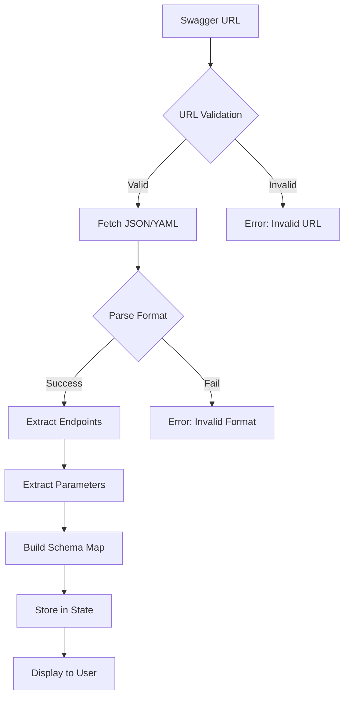

# Swagger Entegrasyonu ve API Dokümantasyonu

## 📡 Swagger/OpenAPI Parser

### Desteklenen Versiyonlar
- ✅ OpenAPI 3.0.x
- ✅ OpenAPI 3.1.x
- ⚠️ Swagger 2.0 (kısmi destek)

### Parser İşlem Akışı



## 🔧 Parser Implementation

### 1. Swagger Fetching

```javascript
// services/swaggerService.js

async function fetchSwagger(url) {
  try {
    const response = await axios.get(url, {
      timeout: 10000,
      headers: {
        'Accept': 'application/json, application/yaml'
      }
    });
    
    // YAML ise JSON'a çevir
    const data = typeof response.data === 'string' 
      ? yaml.parse(response.data)
      : response.data;
    
    return {
      success: true,
      data: data,
      version: detectVersion(data)
    };
  } catch (error) {
    return {
      success: false,
      error: formatError(error)
    };
  }
}
```

### 2. Endpoint Extraction

```javascript
function extractEndpoints(swaggerData) {
  const endpoints = [];
  const paths = swaggerData.paths || {};
  
  Object.entries(paths).forEach(([path, methods]) => {
    Object.entries(methods).forEach(([method, details]) => {
      if (['get', 'post', 'put', 'patch', 'delete'].includes(method)) {
        endpoints.push({
          id: generateId(path, method),
          path: path,
          method: method.toUpperCase(),
          summary: details.summary || '',
          description: details.description || '',
          tags: details.tags || [],
          parameters: extractParameters(details, swaggerData),
          requestBody: extractRequestBody(details, swaggerData),
          responses: extractResponses(details, swaggerData),
          security: details.security || []
        });
      }
    });
  });
  
  return endpoints;
}
```

### 3. Parameter Extraction

```javascript
function extractParameters(operation, swaggerData) {
  const parameters = [];
  
  // Path ve Query parametreler
  if (operation.parameters) {
    operation.parameters.forEach(param => {
      const resolvedParam = resolveRef(param, swaggerData);
      parameters.push({
        name: resolvedParam.name,
        in: resolvedParam.in, // path, query, header, cookie
        required: resolvedParam.required || false,
        schema: resolveSchema(resolvedParam.schema, swaggerData),
        description: resolvedParam.description || ''
      });
    });
  }
  
  // Request Body parametreleri
  if (operation.requestBody) {
    const body = resolveRef(operation.requestBody, swaggerData);
    const content = body.content || {};
    
    Object.entries(content).forEach(([mediaType, details]) => {
      if (mediaType.includes('json')) {
        const schema = resolveSchema(details.schema, swaggerData);
        const bodyParams = schemaToParameters(schema, 'body');
        parameters.push(...bodyParams);
      }
    });
  }
  
  return parameters;
}
```

### 4. Schema Resolution

```javascript
function resolveSchema(schema, swaggerData) {
  if (!schema) return {};
  
  // $ref çözümleme
  if (schema.$ref) {
    const refPath = schema.$ref.replace('#/', '').split('/');
    let resolved = swaggerData;
    refPath.forEach(key => {
      resolved = resolved[key];
    });
    return resolveSchema(resolved, swaggerData);
  }
  
  const result = {
    type: schema.type,
    format: schema.format,
    required: schema.required || [],
    properties: {}
  };
  
  // String constraints
  if (schema.type === 'string') {
    result.minLength = schema.minLength;
    result.maxLength = schema.maxLength;
    result.pattern = schema.pattern;
    result.enum = schema.enum;
  }
  
  // Number constraints
  if (['integer', 'number'].includes(schema.type)) {
    result.minimum = schema.minimum;
    result.maximum = schema.maximum;
    result.exclusiveMinimum = schema.exclusiveMinimum;
    result.exclusiveMaximum = schema.exclusiveMaximum;
  }
  
  // Array constraints
  if (schema.type === 'array') {
    result.items = resolveSchema(schema.items, swaggerData);
    result.minItems = schema.minItems;
    result.maxItems = schema.maxItems;
  }
  
  // Object properties
  if (schema.type === 'object' && schema.properties) {
    Object.entries(schema.properties).forEach(([key, value]) => {
      result.properties[key] = resolveSchema(value, swaggerData);
    });
  }
  
  return result;
}
```

## 📋 Veri Modelleri

### SwaggerProject
```typescript
interface SwaggerProject {
  id: string;
  name: string;
  url: string;
  version: string; // OpenAPI version
  createdAt: Date;
  lastTestedAt: Date;
  endpoints: Endpoint[];
  info: {
    title: string;
    description: string;
    version: string;
  };
}
```

### Endpoint
```typescript
interface Endpoint {
  id: string;
  path: string;
  method: 'GET' | 'POST' | 'PUT' | 'PATCH' | 'DELETE';
  summary: string;
  description: string;
  tags: string[];
  parameters: Parameter[];
  requestBody?: RequestBody;
  responses: Response[];
  security: SecurityRequirement[];
  testResults?: TestResult[];
}
```

### Parameter
```typescript
interface Parameter {
  name: string;
  in: 'path' | 'query' | 'header' | 'cookie' | 'body';
  required: boolean;
  schema: Schema;
  description: string;
  // Validasyon önerileri
  suggestedValidations: ValidationType[];
}
```

### Schema
```typescript
interface Schema {
  type: 'string' | 'number' | 'integer' | 'boolean' | 'array' | 'object';
  format?: string; // email, date, date-time, uuid, etc.
  
  // String constraints
  minLength?: number;
  maxLength?: number;
  pattern?: string;
  enum?: any[];
  
  // Number constraints
  minimum?: number;
  maximum?: number;
  exclusiveMinimum?: boolean;
  exclusiveMaximum?: boolean;
  
  // Array constraints
  items?: Schema;
  minItems?: number;
  maxItems?: number;
  
  // Object constraints
  properties?: Record<string, Schema>;
  required?: string[];
  additionalProperties?: boolean | Schema;
}
```

## 🎯 Smart Validation Mapping

Schema bilgisine göre otomatik validasyon önerileri:

```javascript
function suggestValidations(parameter) {
  const suggestions = [];
  const schema = parameter.schema;
  
  // Required check
  if (parameter.required) {
    suggestions.push('REQUIRED_CHECK');
  }
  
  // String validations
  if (schema.type === 'string') {
    suggestions.push('WHITESPACE');
    
    if (schema.format === 'email') {
      suggestions.push('EMAIL_CHECK');
    }
    
    if (schema.format === 'phone' || parameter.name.includes('phone')) {
      suggestions.push('PHONE_CHECK');
    }
    
    if (schema.maxLength) {
      suggestions.push('MAX_STRING');
    }
    
    if (schema.format === 'date' || schema.format === 'date-time') {
      suggestions.push('MIN_DATE', 'MAX_DATE');
    }
  }
  
  // Number validations
  if (['integer', 'number'].includes(schema.type)) {
    suggestions.push('NO_STRING');
    
    if (schema.minimum !== undefined) {
      suggestions.push('MIN_NUMBER');
    }
    
    if (schema.maximum !== undefined) {
      suggestions.push('MAX_NUMBER');
    }
  }
  
  return suggestions;
}
```

## 🔐 Authentication Handling

```javascript
// Swagger'da tanımlı security schemes
const securitySchemes = {
  bearerAuth: {
    type: 'http',
    scheme: 'bearer',
    bearerFormat: 'JWT'
  },
  apiKey: {
    type: 'apiKey',
    in: 'header',
    name: 'X-API-Key'
  },
  oauth2: {
    type: 'oauth2',
    flows: {
      authorizationCode: {
        authorizationUrl: 'https://example.com/oauth/authorize',
        tokenUrl: 'https://example.com/oauth/token',
        scopes: {
          'read': 'Read access',
          'write': 'Write access'
        }
      }
    }
  }
};

// Kullanıcıdan auth bilgisi alma
function requestAuthCredentials(endpoint) {
  const requiredAuth = endpoint.security[0]; // İlk security requirement
  
  if (requiredAuth.bearerAuth) {
    return promptForToken('Bearer Token');
  }
  
  if (requiredAuth.apiKey) {
    return promptForApiKey('API Key');
  }
  
  // OAuth için kullanıcı redirect edilmeli
  if (requiredAuth.oauth2) {
    return initiateOAuthFlow();
  }
}
```

## 📊 Test Request Building

```javascript
function buildTestRequest(endpoint, parameter, validationType, testValue) {
  const request = {
    method: endpoint.method,
    url: buildUrl(endpoint.path, parameter, testValue),
    headers: buildHeaders(endpoint),
    data: null
  };
  
  // Path parameter
  if (parameter.in === 'path') {
    request.url = request.url.replace(`{${parameter.name}}`, testValue);
  }
  
  // Query parameter
  if (parameter.in === 'query') {
    request.params = { [parameter.name]: testValue };
  }
  
  // Header parameter
  if (parameter.in === 'header') {
    request.headers[parameter.name] = testValue;
  }
  
  // Body parameter
  if (parameter.in === 'body') {
    request.data = buildRequestBody(endpoint, parameter, testValue);
  }
  
  return request;
}
```

## 🧪 Test Scenarios

### GET Request Test
```javascript
// GET /api/users/{id}?role=admin
{
  endpoint: "GET /api/users/{id}",
  parameters: [
    { name: "id", in: "path", type: "integer" },
    { name: "role", in: "query", type: "string" }
  ],
  testCases: [
    // ID - NoString validation
    { param: "id", value: "abc", expect: 400 },
    
    // Role - MaxString validation
    { param: "role", value: "a".repeat(1000), expect: 400 }
  ]
}
```

### POST Request Test
```javascript
// POST /api/users
{
  endpoint: "POST /api/users",
  requestBody: {
    type: "object",
    properties: {
      email: { type: "string", format: "email" },
      age: { type: "integer", minimum: 0, maximum: 150 }
    },
    required: ["email"]
  },
  testCases: [
    // Email - Required
    { body: {}, expect: 400 },
    
    // Email - Invalid format
    { body: { email: "invalid" }, expect: 400 },
    
    // Age - MaxNumber
    { body: { email: "test@ex.com", age: 999 }, expect: 400 }
  ]
}
```

## 📈 Optimization

### Caching
```javascript
// Swagger dökümanları cache'lenir
const cache = {
  'https://api.example.com/swagger.json': {
    data: { /* ... */ },
    timestamp: Date.now(),
    ttl: 3600000 // 1 saat
  }
};
```

### Parallel Testing
```javascript
// Maksimum 5 concurrent test
const results = await Promise.all(
  testCases.slice(0, 5).map(test => executeTest(test))
);
```

### Rate Limiting
```javascript
// API rate limit'e takılmamak için throttle
const delay = (ms) => new Promise(resolve => setTimeout(resolve, ms));
await delay(100); // Her test arası 100ms
```

## 🛠 Error Handling

```javascript
const errorHandlers = {
  INVALID_URL: 'Geçersiz Swagger URL',
  PARSE_ERROR: 'Swagger dökümanı parse edilemedi',
  NETWORK_ERROR: 'Ağ hatası, tekrar deneyin',
  AUTH_REQUIRED: 'Bu endpoint authentication gerektiriyor',
  RATE_LIMIT: 'API rate limit aşıldı, lütfen bekleyin',
  TIMEOUT: 'İstek zaman aşımına uğradı'
};
```
