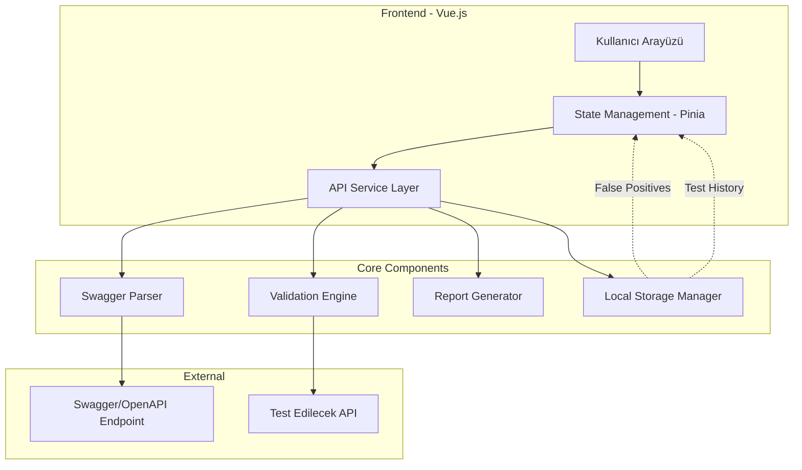

# Sistem Mimarisi

## 🏗 Genel Mimari



## 📦 Katmanlar

### 1. Presentation Layer (UI)
**Sorumluluklar:**
- Kullanıcı etkileşimleri
- Görselleştirme
- Form yönetimi
- Navigation

**Ana Bileşenler:**
- `SwaggerImport.vue` - Swagger URL girişi
- `EndpointList.vue` - Endpoint listesi
- `ValidationConfig.vue` - Validasyon ayarları
- `TestRunner.vue` - Test çalıştırma arayüzü
- `ResultsDashboard.vue` - Sonuç gösterimi

### 2. State Management Layer
**Sorumluluklar:**
- Global state yönetimi
- API yanıtlarını cache'leme
- Reaktif veri akışı

**Stores:**
- `swaggerStore` - Swagger data ve endpoints
- `validationStore` - Validasyon kuralları ve yapılandırma
- `testStore` - Test sonuçları ve geçmiş
- `settingsStore` - Kullanıcı ayarları ve false positives

### 3. Service Layer
**Sorumluluklar:**
- API iletişimi
- İş mantığı
- Data dönüşümleri

**Services:**
- `swaggerService.js` - Swagger parsing
- `validationService.js` - Validasyon testleri
- `apiService.js` - HTTP istekleri
- `storageService.js` - LocalStorage yönetimi

### 4. Core Engine Layer
**Sorumluluklar:**
- Validasyon algoritmaları
- Test senaryoları oluşturma
- Sonuç analizi

## 🔄 Veri Akışı

### Swagger Import Akışı
```
User Input (URL) 
  → swaggerService.fetch()
  → Parser.parse()
  → swaggerStore.setEndpoints()
  → UI Update
```

### Test Execution Akışı
```
User Selects Validations
  → validationService.buildTestCases()
  → Validator.executeTests()
  → Results Collection
  → testStore.saveResults()
  → UI Update
```

### False Positive Flow
```
User Marks False Positive
  → settingsStore.addFalsePositive()
  → storageService.persist()
  → Filter Results
  → UI Update
```

## 💾 Veri Modelleri

### Endpoint Model
```javascript
{
  id: string,
  path: string,
  method: string,
  parameters: Parameter[],
  requestBody: Schema,
  responses: Response[],
  summary: string,
  tags: string[]
}
```

### Parameter Model
```javascript
{
  name: string,
  in: string, // query, path, header, cookie
  required: boolean,
  schema: {
    type: string,
    format: string,
    minimum: number,
    maximum: number,
    minLength: number,
    maxLength: number,
    pattern: string
  }
}
```

### Test Result Model
```javascript
{
  id: string,
  endpointId: string,
  parameterName: string,
  validationType: string,
  testValue: any,
  expectedBehavior: string,
  actualBehavior: string,
  passed: boolean,
  timestamp: Date,
  isFalsePositive: boolean
}
```

### Validation Rule Model
```javascript
{
  type: string,
  enabled: boolean,
  config: {
    severity: string, // error, warning
    testValues: any[]
  }
}
```

## 🔧 Teknoloji Seçimleri ve Gerekçeleri

### Vue.js 3
- Composition API ile daha iyi kod organizasyonu
- Reactivity system
- Hafif ve hızlı
- Kolay öğrenme eğrisi

### Pinia
- Vue 3 için modern state management
- TypeScript desteği
- Daha az boilerplate kod
- DevTools entegrasyonu

### TailwindCSS
- Utility-first yaklaşım
- Hızlı prototipleme
- Tutarlı tasarım sistemi
- Küçük bundle size (production)

### Axios
- Promise tabanlı HTTP client
- Interceptor desteği
- Request/Response transformation
- Error handling

## 🔐 Güvenlik Konuları

1. **CORS:** Target API'ler CORS ayarlarına dikkat
2. **API Keys:** Hassas bilgiler localStorage'da şifrelenmeli
3. **Input Validation:** Swagger URL girişi sanitize edilmeli
4. **XSS Protection:** Test değerleri escape edilmeli

## 📈 Performans Optimizasyonları

1. **Lazy Loading:** Route bazlı component splitting
2. **Debouncing:** Search ve filter işlemleri
3. **Virtual Scrolling:** Büyük endpoint listeleri için
4. **Caching:** Swagger parsing sonuçları
5. **Web Workers:** Ağır test işlemleri için

## 🧪 Test Stratejisi

1. **Unit Tests:** Core validation logic
2. **Component Tests:** Vue component'ler
3. **Integration Tests:** Service layer
4. **E2E Tests:** Kritik kullanıcı akışları

## 🚀 Deployment

### Development
```bash
npm run dev
```

### Production Build
```bash
npm run build
```

### Önerilen Hosting
- Vercel
- Netlify
- GitHub Pages
- Firebase Hosting
