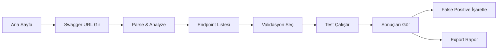
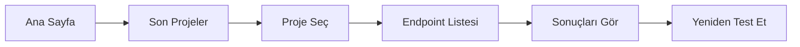
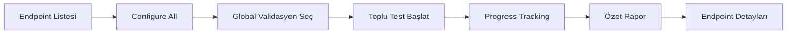

# UI Tasarım ve Kullanıcı Akışları

## 🎨 Tasarım Prensipleri

### Ana Tema
- **Modern & Minimal:** Temiz, profesyonel görünüm
- **Dark Mode First:** Geliştirici odaklı dark theme
- **Color Coding:** Sonuçlar için anlamlı renkler
  - 🟢 Green: Test passed
  - 🔴 Red: Validation missing
  - 🟡 Yellow: Warning
  - ⚪ Gray: Not tested / False positive

### Renk Paleti
```css
/* Dark Theme */
--bg-primary: #0f172a;      /* Slate-900 */
--bg-secondary: #1e293b;    /* Slate-800 */
--bg-tertiary: #334155;     /* Slate-700 */
--text-primary: #f1f5f9;    /* Slate-100 */
--text-secondary: #cbd5e1;  /* Slate-300 */
--accent: #3b82f6;          /* Blue-500 */
--success: #10b981;         /* Green-500 */
--error: #ef4444;           /* Red-500 */
--warning: #f59e0b;         /* Amber-500 */
```

## 📱 Sayfa Yapıları

### 1. Ana Sayfa / Dashboard

```
┌─────────────────────────────────────────────────┐
│  🔍 Validator                      🌙 Dark Mode │
├─────────────────────────────────────────────────┤
│                                                 │
│  ┌───────────────────────────────────────────┐ │
│  │   🚀 Yeni Proje Başlat                    │ │
│  │   Swagger URL: ______________________ →   │ │
│  └───────────────────────────────────────────┘ │
│                                                 │
│  📊 Son Projeler                               │
│  ┌─────────────────┬─────────────────────────┐ │
│  │ My API v1       │  15/20 Endpoints Tested │ │
│  │ 2 hours ago     │  ⚠️ 5 Issues Found      │ │
│  └─────────────────┴─────────────────────────┘ │
│  ┌─────────────────┬─────────────────────────┐ │
│  │ Payment API     │  8/8 Endpoints Tested   │ │
│  │ Yesterday       │  ✅ All Passed          │ │
│  └─────────────────┴─────────────────────────┘ │
│                                                 │
│  📈 İstatistikler                              │
│  ┌─────────┬─────────┬─────────┬────────────┐ │
│  │ Tests   │ Issues  │ Fixed   │ False +    │ │
│  │ 247     │ 23      │ 18      │ 5          │ │
│  └─────────┴─────────┴─────────┴────────────┘ │
└─────────────────────────────────────────────────┘
```

### 2. Endpoint Listesi

```
┌─────────────────────────────────────────────────┐
│  ← Back    MyAPI v1.0 - Endpoints               │
├─────────────────────────────────────────────────┤
│  🔍 Search... _______________  [Configure All]  │
│                                                 │
│  📁 User Management (5)                         │
│  ┌──────────────────────────────────────────┐  │
│  │ POST /api/users              [Configure] │  │
│  │ 3 parameters • Not tested                │  │
│  └──────────────────────────────────────────┘  │
│  ┌──────────────────────────────────────────┐  │
│  │ GET /api/users/{id}          [Configure] │  │
│  │ 1 parameter • ✅ All passed              │  │
│  └──────────────────────────────────────────┘  │
│  ┌──────────────────────────────────────────┐  │
│  │ PUT /api/users/{id}          [Configure] │  │
│  │ 5 parameters • ⚠️ 2 issues               │  │
│  └──────────────────────────────────────────┘  │
│                                                 │
│  📁 Products (8)                                │
│  📁 Orders (12)                                 │
└─────────────────────────────────────────────────┘
```

### 3. Validasyon Yapılandırma

```
┌─────────────────────────────────────────────────┐
│  ← Back    Configure: POST /api/users           │
├─────────────────────────────────────────────────┤
│  📝 Parameters (3)                              │
│  ┌──────────────────────────────────────────┐  │
│  │ ✓ username (string, required)            │  │
│  │ ✓ email (string, required)               │  │
│  │ ✓ age (integer, optional)                │  │
│  └──────────────────────────────────────────┘  │
│                                                 │
│  ✅ Seçili Validasyonlar                        │
│  ┌──────────────────────────────────────────┐  │
│  │ ☑ Required Check        [All params]     │  │
│  │ ☑ Whitespace           [username, email] │  │
│  │ ☑ Email Check          [email]           │  │
│  │ ☑ MaxString            [All strings]     │  │
│  │ ☐ NoString             [age]             │  │
│  │ ☑ MinNumber            [age]             │  │
│  │ ☐ MaxNumber            [age]             │  │
│  │ ☐ Phone Check          [-]               │  │
│  │ ☐ Date Validations     [-]               │  │
│  └──────────────────────────────────────────┘  │
│                                                 │
│  [Cancel]                    [Run Tests] →     │
└─────────────────────────────────────────────────┘
```

### 4. Test Çalıştırma

```
┌─────────────────────────────────────────────────┐
│  Testing: POST /api/users                       │
├─────────────────────────────────────────────────┤
│  Progress: ████████████░░░░░░░░  65% (13/20)   │
│                                                 │
│  ✅ username - Required Check       200ms      │
│  ✅ username - Whitespace           150ms      │
│  ✅ email - Required Check          180ms      │
│  ✅ email - Email Check             220ms      │
│  ❌ email - Whitespace               175ms      │
│     Expected: 400, Got: 200                    │
│     Test Value: "   "                          │
│                                                 │
│  ⏳ Running: email - MaxString...              │
│                                                 │
│  Remaining: 7 tests                            │
│                                                 │
│  [Pause]  [Stop]                               │
└─────────────────────────────────────────────────┘
```

### 5. Sonuçlar ve Rapor

```
┌─────────────────────────────────────────────────┐
│  ← Back    Results: POST /api/users             │
├─────────────────────────────────────────────────┤
│  📊 Summary                                     │
│  ┌────────────────────────────────────────┐    │
│  │ ✅ Passed: 15    ❌ Failed: 3          │    │
│  │ ⏱️ Duration: 2.8s  📅 Dec 27, 2024     │    │
│  └────────────────────────────────────────┘    │
│                                                 │
│  🔴 Issues Found (3)                           │
│  ┌──────────────────────────────────────────┐  │
│  │ 🔴 HIGH: email - Whitespace              │  │
│  │    Test: "   "                           │  │
│  │    Expected: 400, Got: 200               │  │
│  │    💡 Add trim + required validation     │  │
│  │    [Mark as False Positive]   [Details] │  │
│  └──────────────────────────────────────────┘  │
│  ┌──────────────────────────────────────────┐  │
│  │ 🟡 MEDIUM: username - MaxString          │  │
│  │    Test: 1000 chars                      │  │
│  │    Expected: 400, Got: 200               │  │
│  │    💡 Add maxLength: 100                 │  │
│  │    [Mark as False Positive]   [Details] │  │
│  └──────────────────────────────────────────┘  │
│                                                 │
│  ✅ Passed Tests (15) [Show All]               │
│                                                 │
│  [Export Report]  [Run Again]  [Configure]     │
└─────────────────────────────────────────────────┘
```

### 6. False Positive Management

```
┌─────────────────────────────────────────────────┐
│  Mark as False Positive                         │
├─────────────────────────────────────────────────┤
│  Endpoint: POST /api/users                      │
│  Parameter: email                               │
│  Validation: Whitespace                         │
│                                                 │
│  📝 Reason (optional):                          │
│  ┌──────────────────────────────────────────┐  │
│  │ API intentionally trims whitespace       │  │
│  │ on server side before validation         │  │
│  └──────────────────────────────────────────┘  │
│                                                 │
│  ⚠️ Bu test bundan sonra raporlarda           │
│     görünmeyecek ve otomatik olarak           │
│     "passed" olarak işaretlenecek.            │
│                                                 │
│  [Cancel]            [Confirm & Save]          │
└─────────────────────────────────────────────────┘
```

## 🔄 Kullanıcı Akışları

### Akış 1: Yeni Proje Oluşturma


### Akış 2: Mevcut Projeye Dönme


### Akış 3: Toplu Test


## 🎯 Önemli UX Özellikleri

### 1. Smart Defaults
- Parametre tipine göre otomatik validasyon önerisi
- Email field → Email Check otomatik seçili
- Required parameters → Required Check otomatik seçili

### 2. Quick Actions
- Keyboard shortcuts (ESC, Enter, Ctrl+K search)
- Bulk operations
- Quick filters

### 3. Progress Indicators
- Real-time test progress
- Estimated time remaining
- Success/failure counters

### 4. Responsive Design
```
Desktop (1024+)     Tablet (768-1023)    Mobile (< 768)
┌───────────────┐   ┌──────────┐         ┌─────┐
│ Side │  Main  │   │   Main   │         │Main │
│ Nav  │ Content│   │ Content  │         │Cont │
│      │        │   │ (Stacked)│         │ent  │
└───────────────┘   └──────────┘         └─────┘
```

### 5. Error States
- Network errors için retry mechanism
- Invalid Swagger URL için helpful errors
- API timeout handling

### 6. Loading States
- Skeleton screens
- Shimmer effects
- Progress indicators

## 📦 Component Hierarchy

```
App.vue
├── Layout.vue
│   ├── Sidebar.vue
│   └── MainContent.vue
│
├── Pages
│   ├── Dashboard.vue
│   │   ├── ProjectCard.vue
│   │   └── StatsWidget.vue
│   │
│   ├── EndpointList.vue
│   │   ├── EndpointGroup.vue
│   │   └── EndpointItem.vue
│   │
│   ├── ValidationConfig.vue
│   │   ├── ParameterList.vue
│   │   └── ValidationCheckbox.vue
│   │
│   ├── TestRunner.vue
│   │   ├── ProgressBar.vue
│   │   └── TestResultItem.vue
│   │
│   └── Results.vue
│       ├── ResultSummary.vue
│       ├── IssueCard.vue
│       └── FalsePositiveModal.vue
│
└── Shared
    ├── Button.vue
    ├── Input.vue
    ├── Modal.vue
    ├── Badge.vue
    └── Spinner.vue
```

## 🎨 Animation & Transitions

### Page Transitions
```css
.page-enter-active, .page-leave-active {
  transition: opacity 0.2s ease;
}
.page-enter-from, .page-leave-to {
  opacity: 0;
}
```

### List Animations
```css
.list-enter-active, .list-leave-active {
  transition: all 0.3s ease;
}
.list-enter-from {
  opacity: 0;
  transform: translateY(-10px);
}
.list-leave-to {
  opacity: 0;
  transform: translateY(10px);
}
```

### Micro-interactions
- Button hover effects
- Card hover lift
- Success/error shake animations
- Loading pulse effects

## 📱 Accessibility

- Semantic HTML
- ARIA labels
- Keyboard navigation
- Focus indicators
- Screen reader support
- Color contrast (WCAG AA)
